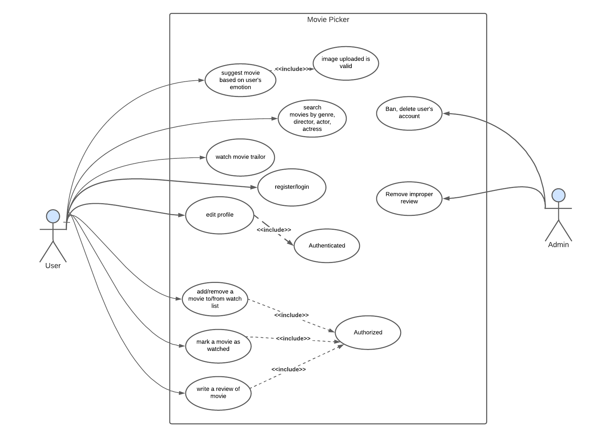

# Popcorn 
## Contributors

- [@thienkaito](https://www.github.com/thienkaito) [Ле Нгок Тхиен]
- [@ducthangchin](https://github.com/ducthangchin) [Чинь Дык Тханг]
- [@jasmine150720](https://github.com/jasmine150720) [Нгуен Тхи Ми Ту]
## Description
***WE HELP YOU MAKE YOUR CHOICE.  ***
You want to find good movies to watch but you have no idea what to choose. Popcorn website can help you out. It can list movies by director, actors and kinds of categories such as horror, romance, drama, action, thriller, etc. Hundreds of films are released every month across the globe. Selecting the best ones according to one’s interests and preferences can be very challenging. This is why it is recommended to go through movie reviews, as they give a detailed insight into the story. 
You can read honest and detailed movie reviews or you can also be a reviewer of those movies through our website. **And more specifically**, we have a movie recommendation feature according to users' emotions when they upload their photos.

## Features

- Register new user
- 

## Tech

- [ReactJS] - JS library for frontend development
- [node.js] - evented I/O for the backend
- [ExpressJS] - fast node.js network app framework, manages the website’s backend functionality and structure.

## Resource
Google font: https://fonts.google.com/

Boxicons: https://boxicons.com/

Images: https://unsplash.com/

External API: 

- [Youtube API:](https://developers.google.com/youtube/v3/docs) We use API provided by Youtube to search for trailer video matching specific term of each video and to add trailer videos in the website by embedding them.
- [The movie Database:](https://developers.themoviedb.org/3) A popular, user editable database for movies and TV shows.

## Usecase

## Demo 
> Sketch on Figma
### Dashboard

### Movie Preview

### Search

### My List

## License
[MIT](https://choosealicense.com/licenses/mit/)

## Contact
